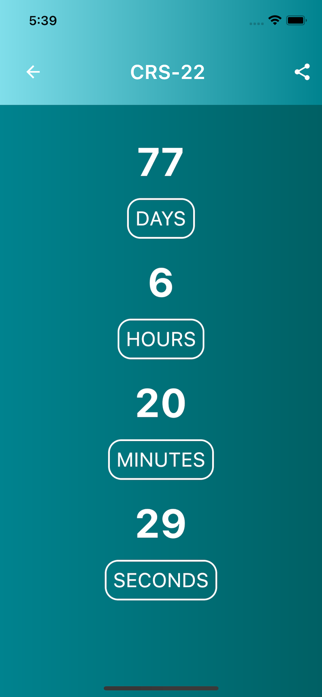

# SpaceX Launcher

<br />
<p align="center">
  
  </a>

  <h3 align="center">Space X Launcher</h3>

  <p align="center">
  This application allows you to view upcoming launches by SpaceX, save your favorite ones and share them with friends!
</p>

<!-- TABLE OF CONTENTS -->
<details open="open">
  <summary><h2 style="display: inline-block">Table of Contents</h2></summary>
  <ol>
    <li>
      <a href="#about-the-project">About The Project</a>
      <ul>
        <li><a href="#built-with">Built With</a></li>
      </ul>
    </li>
    <li>
      <a href="#getting-started">Getting Started</a>
      <ul>
        <li><a href="#prerequisites">Prerequisites</a></li>
        <li><a href="#installation">Installation</a></li>
      </ul>
    </li>
  </ol>
</details>


<!-- ABOUT THE PROJECT -->
## About The Project

This application allows you to view upcoming launches by SpaceX, save your favorite ones and share them with friends!

Features include:

- View all upcoming launches from SpaceX
- View a countdown of the selected launch
- Share the launch via social media
- Favorite your most anticipated launches to save them for later


### Built With

This project is built with Flutter.

A few resources to get you started if this is your first Flutter project:

- [Lab: Write your first Flutter app](https://flutter.dev/docs/get-started/codelab)
- [Cookbook: Useful Flutter samples](https://flutter.dev/docs/cookbook)

For help getting started with Flutter, view our
[online documentation](https://flutter.dev/docs), which offers tutorials,
samples, guidance on mobile development, and a full API reference.


<!-- GETTING STARTED -->
## Getting Started

To get a local copy up and running follow these simple steps.

### Prerequisites

Follow the steps on [flutter dev](https://flutter.dev/) to install the Flutter SDK

### Installation

1. Clone the repo
   ```sh
   git clone [repo]
   ```
2. Install packages
   ```sh
   flutter packages get
   ```

### Running tests

There is currently an issue with [unit testing using sqflite](https://github.com/tekartik/sqflite/issues/324) where mocking cannot be with the `test` package. The alternative is detailed [here](https://github.com/tekartik/sqflite/blob/master/sqflite/doc/testing.md) and is outlined below.

Tests can be executed individually with the following command:

```sh
flutter run test/name_of_testfile.dart
```

For example, if you want to run the bloc tests, do:
```sh
flutter run test/launches_bloc_test.dart
```


### iOS Demo




### Android Demo


